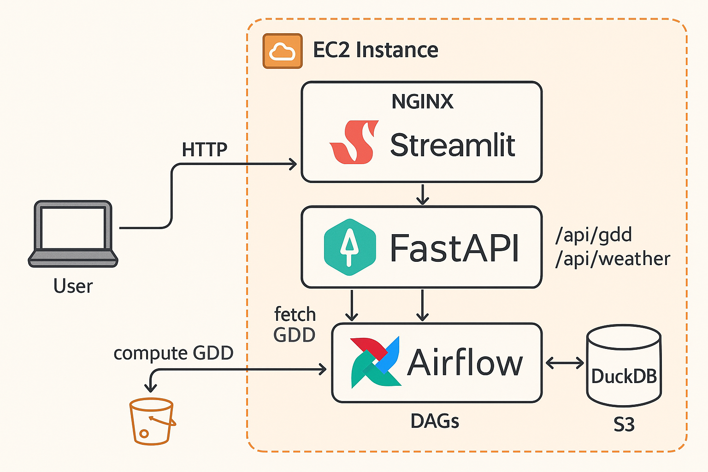

# System Architecture & Data Flow

## Overview

This document outlines the system architecture for the farmer's assistant application.

| Component | Role                                                            |
| --------- | --------------------------------------------------------------- |
| FastAPI   | Backend API to serve weather and GDD data                       |
| Streamlit | Frontend dashboard for farmers to visualize GDD                 |
| Airflow   | Orchestration tool to schedule and run data ingestion pipelines |
| DuckDB    | Lightweight embedded database to query gdd data       |
| S3 (AWS)  | Cloud storage to store and query exctracted raw weather data    |
| NGINX     | Reverse proxy to route traffic between frontend and backend     |
| Docker    | Containerization for modular, isolated components               |
| EC2 (AWS) | Cloud VM hosting the full application stack                     |
| Terraform | Infrastructure-as-code tool to provision AWS resources          |

## Data Flow

            ┌──────────────┐
            │  Yr.no API   │
            └──────────────┘
                   ▼
            ┌──────────────┐
            │   ETL DAGs   │
            └──────────────┘
                   ▼
            ┌──────────────┐
            │   S3 Bucket  │
            │ Layer:Bronze │
            └──────────────┘
                   ▼
            ┌──────────────┐
            │   ETL DAGs   │
            └──────────────┘
                   ▼
            ┌──────────────┐
            │   DuckDB     │
            │ Schema:Silver│
            └──────────────┘
                   ▼
            ┌──────────────┐
            │   ETL DAGs   │
            └──────────────┘
                   ▼
            ┌──────────────┐
            │   DuckDB     │
            │ Schema:Gold  │
            └──────────────┘
                   ▼
            ┌──────────────┐
            │   FastAPI    │
            └──────────────┘
                   ▼
            ┌──────────────┐
            │   Client     │
            └──────────────┘

## API Usage (Yr.no)

- [Yr.no](https://developer.yr.no/) for developers.
- [Terms of Service of API usage](https://developer.yr.no/doc/TermsOfService/)
- Follows guidelines: authenticated headers, proxy-ready logic
- Traffic to Yr.no is **not triggered by user activity**, but instead scheduled via **Airflow DAGs**.
- Weather data is **fetched periodically** and raw data **stored in S3**, to be processed further.
- Weather data is used to calculate GDD to estimate plant growth, and calculations are stored in minIO or S3.

## Docker Architecture

- Each major component (NGINX, FastAPI, Streamlit, Airflow) runs in its own isolated Docker container.
- All containers are managed using Docker Compose, and share a network that allows them to communicate internally.
- NGINX uses this internal network to route requests to the appropriate container (e.g., `/api/ → FastAPI`, `/ → Streamlit`).

## Cloud Infrastructure

- Hosted on **AWS EC2** with the Free Tier
- Uses **Terraform** to provision:
  - EC2 instance
  - Security groups
  - S3
- All internet-facing traffic is routed through **NGINX**, which:
  - Hides internal ports.
  - Acts as a security and routing gateway.
  - Can be upgraded to a **load balancer** if scaling is needed. NGINX hides infrastructure complexity and only exposes the necessary interfaces to the user.
      
    

## Tech Stack

- Python
- SQL
- FastAPI
- Streamlit
- Apache Airflow
- DuckDB
- NGINX
- Docker & Docker Compose
- AWS EC2
- AWS S3
- Terraform

## Related Documentation

For more information on specific aspects of the architecture, refer to the following documentation:

- [System Architecture](./system-architecture.md) - Overall system design and component interactions.
- [Data Flow and Modeling](./data-flow-and-modeling.md) - Information on data processing and storage.
- [API Documentation](./api-documentation.md) - API endpoint specifications and usage.
- [Yr.no API Compliance](./yrno-api-compliance.md) - Compliance with the Yr.no Weather API terms of service.
- [AWS Services](./aws-services.md) - Details on AWS infrastructure and IAM configurations.
- [Containerisation](./containerisation.md) - Information on Docker container security and isolation.
- [Reverse Proxy](./reverse-proxy.md) - Details on Nginx configuration and access controls.
- [Security Architecture](./security-architecture.md) - Overview of the security measures and design.
- [Testing Plan](./testing-plan.md) - Outline of the testing strategy, including security testing.

These documents provide further context and detail on implementation throughout the system.